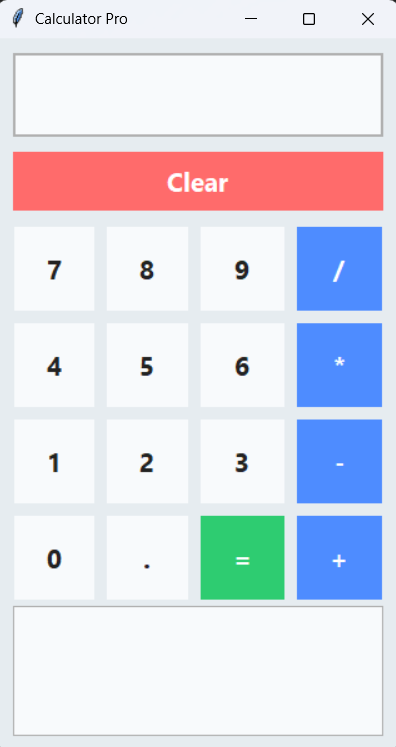

# Calculator Pro

A modern, themeable calculator app built with Python and Tkinter.

## Features
- Basic arithmetic operations
- Calculation history
- Dark/Light theme toggle
- Responsive, resizable window

## Usage
Run `python calculator.py` to start the app.

## Screenshots

